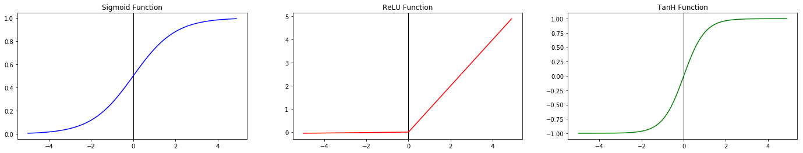
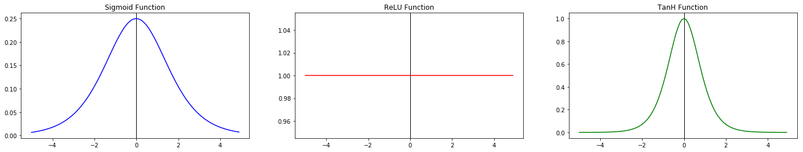
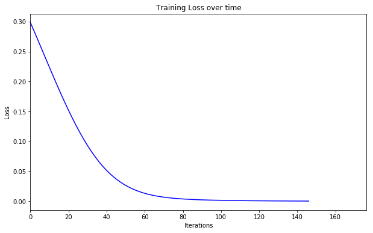

## Tutorial on Backpropagation

Start off by importing the required packages. 
```python
%matplotlib inline
import numpy as np
from pprint import pprint
from random import random
from matplotlib import pyplot as plt
plt.style.use('seaborn-pastel')
```
### Neural Networks - Activation Function
The activation function is one of the most important parts of a Neural Network. It works by taking an input value, which might be a scalar or a vector (numpy array), and returns the output depending on whether the input has crossed a certain threshold. This threshold value is determined by the particular function used.  
Typical activation functions used for Neural networks are:  
- Sigmoid Function  
- Hyperbolic Tangent Function
- Rectified Linear Unit (ReLU)  

```python
def actv_fn(x, fn='sigmoid', derivative=False):
    if not derivative:
        if fn == 'sigmoid': 
            return 1/(1+np.exp(-x))
        elif fn == 'relu':
            if x>0:
                return x
            else:
                return 0.01*x # leaky relu
        elif fn == 'tanh':
            return (2/(1+np.exp(-2*x)))-1
        else:
            return None
    else:
        if fn == 'sigmoid':
            # input x is value of sigmoid(x)
            return x*(1-x)
        elif fn == 'relu':
            # input x is value of relu(x) i.e x or 0.01x
            if x: 
                return 1
            return 0.01
        elif fn == 'tanh':
            # input x is value of tanh(x)
            return 1 - x*x
        else:
            return None

def error(y, yhat):
    return np.sum((np.subtract(yhat, y)**2)/2)
```


```python
x = np.arange(-5, 5, 0.1)
fig = plt.figure(figsize=(24, 4))

y1 = [actv_fn(i, fn='sigmoid') for i in x]
ax1 = fig.add_subplot(131)
ax1.set_title('Sigmoid Function')
ax1.axvline(0, linewidth=1, color='black')
ax1.plot(x, y1, 'b-')

y2 = [actv_fn(i, fn='relu') for i in x]
ax2 = fig.add_subplot(132)
ax2.set_title('ReLU Function')
ax2.axvline(0, linewidth=1, color='black')
ax2.plot(x, y2, 'r-')

y3 = [actv_fn(i, fn='tanh') for i in x]
ax3 = fig.add_subplot(133)
ax3.set_title('TanH Function')
ax3.axvline(0, linewidth=1, color='black')
ax3.plot(x, y3, 'g-')
```

The training process of a Neural network involves two steps, a forward pass and a backward pass, both of which use the activation function. In the backward pass, or backpropagation step, we are more concerned with the derivative of the activation function, the reason for which is explained later in this tutorial. Taking the derivative of any function at a point simply means finding the slope of the function at that point. It is easier to visualize the derivative when the function is in the form of a graph, as shown below.  




```python
x = np.arange(-5, 5, 0.1)
fig = plt.figure(figsize=(24, 4))

y1 = [actv_fn(i, fn='sigmoid') for i in x]
y1 = [actv_fn(i, fn='sigmoid', derivative=True) for i in y1]
ax1 = fig.add_subplot(131)
ax1.set_title('Derivative of Sigmoid Function')
ax1.axvline(0, linewidth=1, color='black')
ax1.plot(x, y1, 'b-')

y2 = [actv_fn(i, fn='relu') for i in x]
y2 = [actv_fn(i, fn='relu', derivative=True) for i in y2]
ax2 = fig.add_subplot(132)
ax2.set_title('Derivative of ReLU Function')
ax2.axvline(0, linewidth=1, color='black')
ax2.plot(x, y2, 'r-')

y3 = [actv_fn(i, fn='tanh') for i in x]
y3 = [actv_fn(i, fn='tanh', derivative=True) for i in y3]
ax3 = fig.add_subplot(133)
ax3.set_title('Derivative of TanH Function')
ax3.axvline(0, linewidth=1, color='black')
ax3.plot(x, y3, 'g-')
```

The gradients of the respective activation functions can be graphed similarly.




```python
class NeuralNet:
    def __init__(self, data, labels, weights, biases, function='sigmoid', learning_rate=0.05, tolerance=1e-5, max_iter=10000):
        self.x = data
        self.y = labels
        self.wts = weights
        self.b = biases
        self.fn = function
        self.eta = learning_rate
        self.tol = tolerance
        self.iterations = max_iter
        self.activations = []
        self.ERRORS = []
        self.show_params()
    
    def show_params(self):
        print "Activation Function :", self.fn
        print "Learning Rate :", self.eta
        print "Tolerance :", self.tol
        print "Maximum Iterations :", self.iterations
        print ""
    
        
    def train(self):
        for i in range(self.iterations):
            if len(self.ERRORS)>1:
                err_delta = self.ERRORS[-2]-self.ERRORS[-1]
                #print err_delta
                if err_delta<self.tol:
                    print "Converged at step", i-1, "with error", self.ERRORS[-1]
                    break
            self.frontprop()
            self.backprop()
    
    def frontprop(self, mode='train', pred_input=None):
        #print "Original weights"
        #pprint(self.wts)
        #print ""
        print "Iteration", len(self.ERRORS)
        print "Starting frontprop pass"
        if mode == 'train':
            fp_input=self.x
        elif mode == 'predict':
            assert(pred_input is not None)
            fp_input = pred_input
        else:
            return None
        
        for j in range(self.wts.shape[0]):
            #print "weight arr index :", j
            #print "input"
            if j == 0:
                inp = fp_input.copy()
                #print inp, "\n"
            else:
                inp = self.activations[-1]
                #print inp, "\n"
            outs = []
            for k in range(self.wts.shape[j]):
                #print "NET CALC : input", inp, ", weights", self.wts[j][k], ", biases", self.b[j]
                #print "W:", len(self.wts), self.wts.shape, self.wts[j].shape, self.wts[j][k].shape, "X:", inp.shape, "b:", self.b.shape
                net = np.dot(self.wts[j][k], inp)+self.b[j]
                #print "NET :"
                #pprint(net)
                #print "OUT :"
                out = actv_fn(net, fn=self.fn)
                #pprint(out)
                outs.append(out)
                #print "----------"
            #print outs
            self.activations.append(np.array(outs))
            #print "----------------------------"
        final = self.activations[-1]
        final = np.array(final)
        total_error = 0.0
        for l in range(len(final)):
            #print l, final[l], self.y[l]
            err = error(final[l], self.y[l])
            total_error += err
        if mode == 'predict':
            return final
        print "total error", total_error
        self.ERRORS.append(total_error)
    
    def backprop(self):
        print "Starting backprop pass"
        #print "Prev layers", len(self.activations)
        for j in range(self.wts.shape[0]):
            #print "Prev layers j", len(self.activations[j])
            for k in range(self.wts.shape[j]):
                p1 = self.activations[k][j]-self.y[j]
                #print "out_o - target", p1
                p2 = actv_fn(self.activations[k][j], fn=self.fn, derivative=True)
                #print "out_o*(1-out_o)", p2
                p3 = self.activations[k-1][j]
                #print "out_h", p3
                delta = -1*p1*p2*p3
                #print "delta", delta
                #print "change", self.eta*delta
                for l in range(len(self.wts[k][j])):
                    new_w = self.wts[k][j][l] + self.eta*delta # learning step
                    self.wts[k][j][l] = new_w
                #print ""
        #print "Modified Weights"
        #pprint(self.wts)
        print "\n====================================================\n"
                
    def predict(self, input_x):
        return self.frontprop(mode='predict', pred_input=input_x)
    
    def plot_loss(self):
        plt.figure(figsize=(10,6))
        plt.xlim(0, 1.2*len(self.ERRORS))
        plt.xlabel('Iterations')
        plt.ylabel('Loss')
        plt.title('Training Loss over time')
        plt.plot([i for i in range(len(self.ERRORS))], self.ERRORS, 'b-')
        plt.show()
```


```python
X = np.array([[0.05], [0.10]])
Y = np.array([[0.01], [0.99]])
W = np.array([
                [[0.15, 0.20],[0.25, 0.30]], #layer 0->1
                [[0.40, 0.45],[0.50, 0.55]]  #layer 1->2
               ])
B = np.array([[0.35], [0.6]])
NN = NeuralNet(X, Y, W, B, 'sigmoid', 0.5, 1e-5, 1000)
NN.train()
NN.plot_loss()
```

    Activation Function : sigmoid
    Learning Rate : 0.5
    Tolerance : 1e-05
    Maximum Iterations : 1000
    
    Iteration 0
    Starting frontprop pass
    total error 0.29837110876
    Starting backprop pass
    
    ====================================================
    
    Iteration 1
    Starting frontprop pass
    total error 0.291036316578
    Starting backprop pass
    
    ====================================================
    
    Iteration 2
    Starting frontprop pass
    total error 0.283643557043
    Starting backprop pass
    
    ====================================================
    
    Iteration 3
    Starting frontprop pass
    total error 0.27620148507
    Starting backprop pass
    
    ====================================================
    
    Iteration 4
    Starting frontprop pass
    total error 0.268719165641
    Starting backprop pass
    
    ====================================================
    
    Iteration 5
    Starting frontprop pass
    total error 0.26120603932
    Starting backprop pass
    
    ====================================================
    
    Iteration 6
    Starting frontprop pass
    total error 0.253671883599
    Starting backprop pass
    
    ====================================================
    
    Iteration 7
    Starting frontprop pass
    total error 0.246126770248
    Starting backprop pass
    
    ====================================================
    
    Iteration 8
    Starting frontprop pass
    total error 0.23858101896
    Starting backprop pass
    
    ====================================================
    
    Iteration 9
    Starting frontprop pass
    total error 0.231045147593
    Starting backprop pass
    
    ====================================================
    
    Iteration 10
    Starting frontprop pass
    total error 0.223529819409
    Starting backprop pass
    
    ====================================================
    
    Iteration 11
    Starting frontprop pass
    total error 0.216045787745
    Starting backprop pass
    
    ====================================================
    
    Iteration 12
    Starting frontprop pass
    total error 0.208603838607
    Starting backprop pass
    
    ====================================================
    
    Iteration 13
    Starting frontprop pass
    total error 0.201214731724
    Starting backprop pass
    
    ====================================================
    
    Iteration 14
    Starting frontprop pass
    total error 0.193889140656
    Starting backprop pass
    
    ====================================================
    
    Iteration 15
    Starting frontprop pass
    total error 0.186637592532
    Starting backprop pass
    
    ====================================================
    
    Iteration 16
    Starting frontprop pass
    total error 0.179470408085
    Starting backprop pass
    
    ====================================================
    
    Iteration 17
    Starting frontprop pass
    total error 0.1723976426
    Starting backprop pass
    
    ====================================================
    
    Iteration 18
    Starting frontprop pass
    total error 0.165429028427
    Starting backprop pass
    
    ====================================================
    
    Iteration 19
    Starting frontprop pass
    total error 0.158573919694
    Starting backprop pass
    
    ====================================================
    
    Iteration 20
    Starting frontprop pass
    total error 0.151841239834
    Starting backprop pass
    
    ====================================================
    
    Iteration 21
    Starting frontprop pass
    total error 0.145239432499
    Starting backprop pass
    
    ====================================================
    
    Iteration 22
    Starting frontprop pass
    total error 0.138776416422
    Starting backprop pass
    
    ====================================================
    
    Iteration 23
    Starting frontprop pass
    total error 0.132459544692
    Starting backprop pass
    
    ====================================================
    
    Iteration 24
    Starting frontprop pass
    total error 0.126295568896
    Starting backprop pass
    
    ====================================================
    
    Iteration 25
    Starting frontprop pass
    total error 0.120290608474
    Starting backprop pass
    
    ====================================================
    
    Iteration 26
    Starting frontprop pass
    total error 0.114450125586
    Starting backprop pass
    
    ====================================================
    
    Iteration 27
    Starting frontprop pass
    total error 0.108778905701
    Starting backprop pass
    
    ====================================================
    
    Iteration 28
    Starting frontprop pass
    total error 0.103281044033
    Starting backprop pass
    
    ====================================================
    
    Iteration 29
    Starting frontprop pass
    total error 0.0979599378821
    Starting backprop pass
    
    ====================================================
    
    Iteration 30
    Starting frontprop pass
    total error 0.0928182848366
    Starting backprop pass
    
    ====================================================
    
    Iteration 31
    Starting frontprop pass
    total error 0.0878580867197
    Starting backprop pass
    
    ====================================================
    
    Iteration 32
    Starting frontprop pass
    total error 0.0830806590984
    Starting backprop pass
    
    ====================================================
    
    Iteration 33
    Starting frontprop pass
    total error 0.0784866460811
    Starting backprop pass
    
    ====================================================
    
    Iteration 34
    Starting frontprop pass
    total error 0.0740760400786
    Starting backprop pass
    
    ====================================================
    
    Iteration 35
    Starting frontprop pass
    total error 0.0698482061409
    Starting backprop pass
    
    ====================================================
    
    Iteration 36
    Starting frontprop pass
    total error 0.065801910434
    Starting backprop pass
    
    ====================================================
    
    Iteration 37
    Starting frontprop pass
    total error 0.0619353523791
    Starting backprop pass
    
    ====================================================
    
    Iteration 38
    Starting frontprop pass
    total error 0.0582461999507
    Starting backprop pass
    
    ====================================================
    
    Iteration 39
    Starting frontprop pass
    total error 0.0547316276044
    Starting backprop pass
    
    ====================================================
    
    Iteration 40
    Starting frontprop pass
    total error 0.0513883563001
    Starting backprop pass
    
    ====================================================
    
    Iteration 41
    Starting frontprop pass
    total error 0.0482126950812
    Starting backprop pass
    
    ====================================================
    
    Iteration 42
    Starting frontprop pass
    total error 0.0452005836822
    Starting backprop pass
    
    ====================================================
    
    Iteration 43
    Starting frontprop pass
    total error 0.042347635651
    Starting backprop pass
    
    ====================================================
    
    Iteration 44
    Starting frontprop pass
    total error 0.039649181498
    Starting backprop pass
    
    ====================================================
    
    Iteration 45
    Starting frontprop pass
    total error 0.037100311416
    Starting backprop pass
    
    ====================================================
    
    Iteration 46
    Starting frontprop pass
    total error 0.0346959171469
    Starting backprop pass
    
    ====================================================
    
    Iteration 47
    Starting frontprop pass
    total error 0.0324307326187
    Starting backprop pass
    
    ====================================================
    
    Iteration 48
    Starting frontprop pass
    total error 0.0302993730126
    Starting backprop pass
    
    ====================================================
    
    Iteration 49
    Starting frontprop pass
    total error 0.0282963719738
    Starting backprop pass
    
    ====================================================
    
    Iteration 50
    Starting frontprop pass
    total error 0.0264162167199
    Starting backprop pass
    
    ====================================================
    
    Iteration 51
    Starting frontprop pass
    total error 0.0246533808527
    Starting backprop pass
    
    ====================================================
    
    Iteration 52
    Starting frontprop pass
    total error 0.0230023547237
    Starting backprop pass
    
    ====================================================
    
    Iteration 53
    Starting frontprop pass
    total error 0.0214576732477
    Starting backprop pass
    
    ====================================================
    
    Iteration 54
    Starting frontprop pass
    total error 0.0200139411028
    Starting backprop pass
    
    ====================================================
    
    Iteration 55
    Starting frontprop pass
    total error 0.0186658552921
    Starting backprop pass
    
    ====================================================
    
    Iteration 56
    Starting frontprop pass
    total error 0.0174082250801
    Starting backprop pass
    
    ====================================================
    
    Iteration 57
    Starting frontprop pass
    total error 0.0162359893472
    Starting backprop pass
    
    ====================================================
    
    Iteration 58
    Starting frontprop pass
    total error 0.0151442314358
    Starting backprop pass
    
    ====================================================
    
    Iteration 59
    Starting frontprop pass
    total error 0.0141281915826
    Starting backprop pass
    
    ====================================================
    
    Iteration 60
    Starting frontprop pass
    total error 0.0131832770548
    Starting backprop pass
    
    ====================================================
    
    Iteration 61
    Starting frontprop pass
    total error 0.0123050701211
    Starting backprop pass
    
    ====================================================
    
    Iteration 62
    Starting frontprop pass
    total error 0.0114893340032
    Starting backprop pass
    
    ====================================================
    
    Iteration 63
    Starting frontprop pass
    total error 0.010732016959
    Starting backprop pass
    
    ====================================================
    
    Iteration 64
    Starting frontprop pass
    total error 0.010029254658
    Starting backprop pass
    
    ====================================================
    
    Iteration 65
    Starting frontprop pass
    total error 0.0093773710088
    Starting backprop pass
    
    ====================================================
    
    Iteration 66
    Starting frontprop pass
    total error 0.00877287759849
    Starting backprop pass
    
    ====================================================
    
    Iteration 67
    Starting frontprop pass
    total error 0.00821247190372
    Starting backprop pass
    
    ====================================================
    
    Iteration 68
    Starting frontprop pass
    total error 0.00769303442599
    Starting backprop pass
    
    ====================================================
    
    Iteration 69
    Starting frontprop pass
    total error 0.0072116248991
    Starting backprop pass
    
    ====================================================
    
    Iteration 70
    Starting frontprop pass
    total error 0.00676547770895
    Starting backprop pass
    
    ====================================================
    
    Iteration 71
    Starting frontprop pass
    total error 0.00635199665758
    Starting backprop pass
    
    ====================================================
    
    Iteration 72
    Starting frontprop pass
    total error 0.00596874919424
    Starting backprop pass
    
    ====================================================
    
    Iteration 73
    Starting frontprop pass
    total error 0.00561346022655
    Starting backprop pass
    
    ====================================================
    
    Iteration 74
    Starting frontprop pass
    total error 0.00528400561545
    Starting backprop pass
    
    ====================================================
    
    Iteration 75
    Starting frontprop pass
    total error 0.00497840544726
    Starting backprop pass
    
    ====================================================
    
    Iteration 76
    Starting frontprop pass
    total error 0.00469481716681
    Starting backprop pass
    
    ====================================================
    
    Iteration 77
    Starting frontprop pass
    total error 0.00443152864599
    Starting backprop pass
    
    ====================================================
    
    Iteration 78
    Starting frontprop pass
    total error 0.00418695125286
    Starting backprop pass
    
    ====================================================
    
    Iteration 79
    Starting frontprop pass
    total error 0.00395961297794
    Starting backprop pass
    
    ====================================================
    
    Iteration 80
    Starting frontprop pass
    total error 0.00374815166609
    Starting backprop pass
    
    ====================================================
    
    Iteration 81
    Starting frontprop pass
    total error 0.00355130839462
    Starting backprop pass
    
    ====================================================
    
    Iteration 82
    Starting frontprop pass
    total error 0.00336792103153
    Starting backprop pass
    
    ====================================================
    
    Iteration 83
    Starting frontprop pass
    total error 0.00319691800121
    Starting backprop pass
    
    ====================================================
    
    Iteration 84
    Starting frontprop pass
    total error 0.00303731227915
    Starting backprop pass
    
    ====================================================
    
    Iteration 85
    Starting frontprop pass
    total error 0.00288819563189
    Starting backprop pass
    
    ====================================================
    
    Iteration 86
    Starting frontprop pass
    total error 0.00274873311419
    Starting backprop pass
    
    ====================================================
    
    Iteration 87
    Starting frontprop pass
    total error 0.00261815783063
    Starting backprop pass
    
    ====================================================
    
    Iteration 88
    Starting frontprop pass
    total error 0.00249576596613
    Starting backprop pass
    
    ====================================================
    
    Iteration 89
    Starting frontprop pass
    total error 0.00238091208602
    Starting backprop pass
    
    ====================================================
    
    Iteration 90
    Starting frontprop pass
    total error 0.00227300470414
    Starting backprop pass
    
    ====================================================
    
    Iteration 91
    Starting frontprop pass
    total error 0.00217150211516
    Starting backprop pass
    
    ====================================================
    
    Iteration 92
    Starting frontprop pass
    total error 0.00207590848528
    Starting backprop pass
    
    ====================================================
    
    Iteration 93
    Starting frontprop pass
    total error 0.00198577019428
    Starting backprop pass
    
    ====================================================
    
    Iteration 94
    Starting frontprop pass
    total error 0.00190067242034
    Starting backprop pass
    
    ====================================================
    
    Iteration 95
    Starting frontprop pass
    total error 0.00182023595858
    Starting backprop pass
    
    ====================================================
    
    Iteration 96
    Starting frontprop pass
    total error 0.00174411426314
    Starting backprop pass
    
    ====================================================
    
    Iteration 97
    Starting frontprop pass
    total error 0.00167199070244
    Starting backprop pass
    
    ====================================================
    
    Iteration 98
    Starting frontprop pass
    total error 0.00160357601697
    Starting backprop pass
    
    ====================================================
    
    Iteration 99
    Starting frontprop pass
    total error 0.0015386059686
    Starting backprop pass
    
    ====================================================
    
    Iteration 100
    Starting frontprop pass
    total error 0.00147683917065
    Starting backprop pass
    
    ====================================================
    
    Iteration 101
    Starting frontprop pass
    total error 0.00141805508796
    Starting backprop pass
    
    ====================================================
    
    Iteration 102
    Starting frontprop pass
    total error 0.00136205219634
    Starting backprop pass
    
    ====================================================
    
    Iteration 103
    Starting frontprop pass
    total error 0.00130864629117
    Starting backprop pass
    
    ====================================================
    
    Iteration 104
    Starting frontprop pass
    total error 0.00125766893513
    Starting backprop pass
    
    ====================================================
    
    Iteration 105
    Starting frontprop pass
    total error 0.00120896603553
    Starting backprop pass
    
    ====================================================
    
    Iteration 106
    Starting frontprop pass
    total error 0.00116239654197
    Starting backprop pass
    
    ====================================================
    
    Iteration 107
    Starting frontprop pass
    total error 0.00111783125568
    Starting backprop pass
    
    ====================================================
    
    Iteration 108
    Starting frontprop pass
    total error 0.00107515174204
    Starting backprop pass
    
    ====================================================
    
    Iteration 109
    Starting frontprop pass
    total error 0.00103424933867
    Starting backprop pass
    
    ====================================================
    
    Iteration 110
    Starting frontprop pass
    total error 0.000995024251333
    Starting backprop pass
    
    ====================================================
    
    Iteration 111
    Starting frontprop pass
    total error 0.000957384731039
    Starting backprop pass
    
    ====================================================
    
    Iteration 112
    Starting frontprop pass
    total error 0.000921246325496
    Starting backprop pass
    
    ====================================================
    
    Iteration 113
    Starting frontprop pass
    total error 0.000886531199007
    Starting backprop pass
    
    ====================================================
    
    Iteration 114
    Starting frontprop pass
    total error 0.000853167515014
    Starting backprop pass
    
    ====================================================
    
    Iteration 115
    Starting frontprop pass
    total error 0.000821088876028
    Starting backprop pass
    
    ====================================================
    
    Iteration 116
    Starting frontprop pass
    total error 0.000790233816016
    Starting backprop pass
    
    ====================================================
    
    Iteration 117
    Starting frontprop pass
    total error 0.000760545340698
    Starting backprop pass
    
    ====================================================
    
    Iteration 118
    Starting frontprop pass
    total error 0.000731970511522
    Starting backprop pass
    
    ====================================================
    
    Iteration 119
    Starting frontprop pass
    total error 0.000704460069465
    Starting backprop pass
    
    ====================================================
    
    Iteration 120
    Starting frontprop pass
    total error 0.000677968095047
    Starting backprop pass
    
    ====================================================
    
    Iteration 121
    Starting frontprop pass
    total error 0.00065245170128
    Starting backprop pass
    
    ====================================================
    
    Iteration 122
    Starting frontprop pass
    total error 0.000627870756532
    Starting backprop pass
    
    ====================================================
    
    Iteration 123
    Starting frontprop pass
    total error 0.000604187634519
    Starting backprop pass
    
    ====================================================
    
    Iteration 124
    Starting frontprop pass
    total error 0.0005813669889
    Starting backprop pass
    
    ====================================================
    
    Iteration 125
    Starting frontprop pass
    total error 0.000559375550142
    Starting backprop pass
    
    ====================================================
    
    Iteration 126
    Starting frontprop pass
    total error 0.000538181942534
    Starting backprop pass
    
    ====================================================
    
    Iteration 127
    Starting frontprop pass
    total error 0.000517756519422
    Starting backprop pass
    
    ====================================================
    
    Iteration 128
    Starting frontprop pass
    total error 0.000498071214893
    Starting backprop pass
    
    ====================================================
    
    Iteration 129
    Starting frontprop pass
    total error 0.000479099410309
    Starting backprop pass
    
    ====================================================
    
    Iteration 130
    Starting frontprop pass
    total error 0.000460815814224
    Starting backprop pass
    
    ====================================================
    
    Iteration 131
    Starting frontprop pass
    total error 0.000443196354367
    Starting backprop pass
    
    ====================================================
    
    Iteration 132
    Starting frontprop pass
    total error 0.000426218080481
    Starting backprop pass
    
    ====================================================
    
    Iteration 133
    Starting frontprop pass
    total error 0.000409859076928
    Starting backprop pass
    
    ====================================================
    
    Iteration 134
    Starting frontprop pass
    total error 0.000394098384083
    Starting backprop pass
    
    ====================================================
    
    Iteration 135
    Starting frontprop pass
    total error 0.000378915927604
    Starting backprop pass
    
    ====================================================
    
    Iteration 136
    Starting frontprop pass
    total error 0.000364292454786
    Starting backprop pass
    
    ====================================================
    
    Iteration 137
    Starting frontprop pass
    total error 0.000350209477271
    Starting backprop pass
    
    ====================================================
    
    Iteration 138
    Starting frontprop pass
    total error 0.00033664921944
    Starting backprop pass
    
    ====================================================
    
    Iteration 139
    Starting frontprop pass
    total error 0.000323594571913
    Starting backprop pass
    
    ====================================================
    
    Iteration 140
    Starting frontprop pass
    total error 0.000311029049599
    Starting backprop pass
    
    ====================================================
    
    Iteration 141
    Starting frontprop pass
    total error 0.000298936753851
    Starting backprop pass
    
    ====================================================
    
    Iteration 142
    Starting frontprop pass
    total error 0.000287302338247
    Starting backprop pass
    
    ====================================================
    
    Iteration 143
    Starting frontprop pass
    total error 0.000276110977653
    Starting backprop pass
    
    ====================================================
    
    Iteration 144
    Starting frontprop pass
    total error 0.000265348340182
    Starting backprop pass
    
    ====================================================
    
    Iteration 145
    Starting frontprop pass
    total error 0.000255000561771
    Starting backprop pass
    
    ====================================================
    
    Iteration 146
    Starting frontprop pass
    total error 0.000245054223056
    Starting backprop pass
    
    ====================================================
    
    Converged at step 146 with error 0.000245054223056





### Credits

Props to Matt Mazur, whose excellent article on explaining backprop is the basis for this notebook. Actually working through the derivations helps to get a feel for the underlying intuition, and that article was an invaluable resource in understanding the concept of backprop.  
Link to article : [A Step by Step Backpropagation Example](https://mattmazur.com/2015/03/17/a-step-by-step-backpropagation-example/)  

### To-Do
- Make biases also a part of training process (i.e. update them too)
- Batched gradient descent, momentum
- Scalable vectorized approach, allowing for multiple layers of variable sizes
- Preferably layer-based, like TensorFlow
- Dropout, Regularization etc.


```python

```
